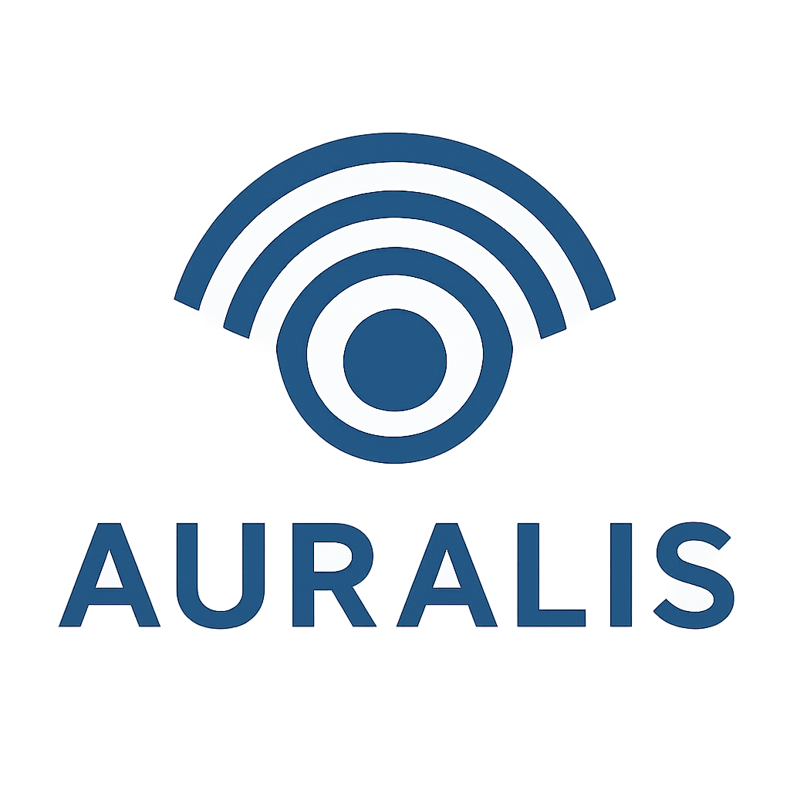
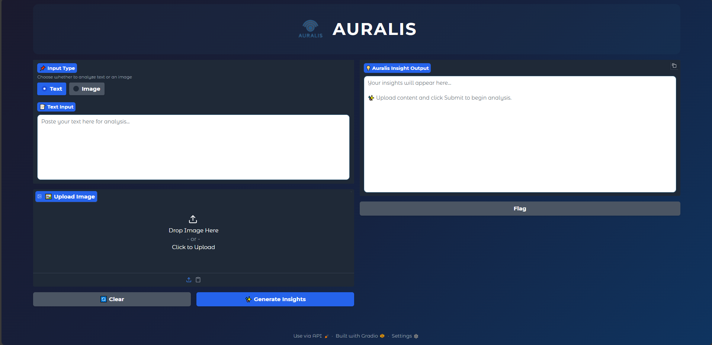

# 🌌 Auralis – AI Document & Image Insight Agent



---

## 📖 Overview

**Auralis** is an intelligent **AI agent** that reads and understands both **text documents** and **images**, extracting **key insights, summaries, and patterns** using multi-modal AI.  
It combines **OCR, LLM reasoning, and graph-based orchestration** to process complex data from reports to scanned tables, invoices and deliver structured insights instantly.

---

## 🚀 Features

- 🖼️ **OCR Processing:** Extracts text from images or scanned documents using *Tesseract OCR*.  
- 🧠 **Text Summarization:** Generates intelligent summaries and key insights from extracted or raw text.  
- 🔗 **Tool Integration:** Modular design using LangGraph with separate OCR and Insight tools.  
- 🧩 **MCP Server:** A built-in MCP (Model Context Protocol) server exposes tools like `ocr_tool` and `insight_tool` for external access.  
- 💬 **Gradio Interface:** Simple and elegant UI for users to upload text or images.  
- 🦙 **LLM Integration:** Powered by *Ollama* and *Gemini*, orchestrated with *LangChain* and *LangGraph*.  
- ⚙️ **Extensible Graph Architecture:** Easy to extend with new nodes, reasoning chains, or RLHF improvements.

---

## 🧱 Tech Stack

| Component | Technology |
|------------|-------------|
| **Language** | Python 3.12 |
| **Frameworks** | LangGraph, LangChain |
| **LLMs** | Ollama, Gemini |
| **OCR Engine** | Tesseract |
| **Frontend** | Gradio |
| **Server** | FastMCP |

---

## 📁 Project Structure


```bash
auralis/
│
├── tools/                          
│   ├── insight_tool.py            # Summarization & insights
│   └── ocr_tool.py                # OCR (Tesseract)
├── app.py                         # Gradio frontend interface        
├── auralis_agent.py               # LangGraph agent logic
├── auralis_logo.png               # Auralis Logo
├── requirements.txt               # Python dependencies
└── README.md                      # Project documentation
```

---

## ⚙️ How to Run

### 1️⃣ Clone the Repository
```bash
# Clone the repo
git clone https://github.com/MinaEd/auralis.git
cd auralis
```

### 2️⃣ Create and activate a virtual environment
```bash
python -m venv venv
source venv/bin/activate   # (Linux/Mac)
venv\Scripts\Activate      # (Windows)
```

### 3️⃣ Install dependencies
```bash
pip install -r requirements.txt
```

### 4️⃣ Launch the Gradio app
```bash
python app.py
```

---

## 🖥️ Interface Preview



---

## 🧩 How It Works

**User input → Text or Image**

**LangGraph Agent** → Routes to the appropriate node:
- 🖼️ **Image → OCR → Insight Summarizer**
- 📝 **Text → Insight Summarizer**

**LLM Processing** → Extracts meaning, patterns, and summaries

**Output** → Displayed in the **Gradio UI**

---

## 🧠 Future Enhancements

- 🗣️ **Voice-based input/output integration**
- 📊 **Insight dashboards for numerical data**
- 🤖 **RLHF for adaptive reasoning and summarization**
- 🔄 **Integration with APIs and web data sources**
- 🧰 **Add more specialized tools for multimodal analysis**

---

## ✨ Author

**Mina Edwar Dawood**